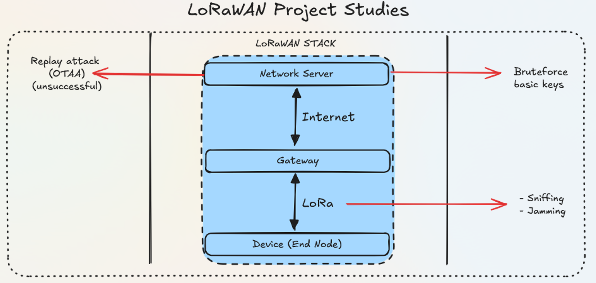

# LoRaWAN Reproduction Attacks

## Overview

After my first LoRa project, I had the opportunity to explore LoRaWAN with a focus on security at the MAC layer.  
This project aimed to reproduce and analyze several attacks on a LoRaWAN network, including replay attacks, packet sniffing, brute-force on weak keys, and jamming. The work combined practical experimentation and analysis of LoRaWAN vulnerabilities.

---

## Project Structure

### 1. Introduction

This project was dedicated to testing and understanding the security of LoRaWAN networks by reproducing several known attacks at the MAC layer. The goal was to observe real-world vulnerabilities and limitations, and to analyze the resilience of low-power wide-area networks (LPWAN) in practical scenarios.

### 2. Infrastructure & Tools

**Hardware**
- **LoRaWAN Gateway**: Raspberry Pi 3 Model B + IC880A LoRa concentrator
- **LoPy4 Pycom**: Used as a legitimate LoRaWAN node
- **Arduino Dragino**: Used for attacker/simulation roles

**Software & Frameworks**
- **ChirpStack**: LoRaWAN network server and web interface for monitoring, management, and packet analysis
- **VS Code + Pymakr Extension**: Programming and flashing the LoPy4 devices
- **Arduino IDE**: Programming and configuring the Dragino board
- **Relevant Arduino Libraries**: LoRa (Sandeep Mistry), MCCI LoRaWAN LMIC (Terry Moore), RadioLib (Jan Gromes)

---

### 3. Attack Scenarios

#### 3.1 Brute-force Attack on Weak Keys

- Explored LoRaMAC 1.0.x weaknesses, notably the use of predictable and default keys (DevEUI, AppKey).
- Demonstrated the possibility to join networks and send data using commonly used/default identifiers.
- Highlighted the importance of updating to LoRaMAC 1.1.x and using strong, randomly generated keys.

#### 3.2 Sniffing

- Intercepted LoRaWAN packets using a Dragino board configured as a passive listener.
- Analyzed captured frames (Join-Request, Data Up) to assess information leakage and network exposure.
- Demonstrated the ability to reconstruct certain identifiers and observe network activity.

#### 3.3 Replay Attack

- Reproduced replay attacks by retransmitting previously captured packets.
- Assessed network resilience to replayed frames, focusing on handling of frame counters (FCnt) and message integrity codes (MIC).
- Explored the impact of replay on data authenticity and network operation.

#### 3.4 Jamming (Denial-of-Service)

- Simulated radio jamming by continuously transmitting signals to saturate the LoRaWAN channel.
- Observed the disruption of legitimate communications and measured the effectiveness of simple denial attacks.
- Discussed the impact of jamming on network reliability and possible countermeasures.

---

### 4. Analysis & Results

- Each attack scenario was deployed in a controlled lab environment using real LoRaWAN hardware and open-source frameworks.
- Vulnerabilities due to protocol versions and poor key management were confirmed to be exploitable.
- Passive and active attacks were tested, with network monitoring via ChirpStack to observe effects and responses.
- Countermeasures and best practices were discussed, including key rotation, protocol updates, and radio monitoring.

---

## Skills Learned

- **LoRaWAN Security**: Practical analysis of protocol vulnerabilities, MAC-layer attacks, and mitigation strategies.
- **Embedded Systems**: Hands-on experience with LoPy4 and Arduino Dragino for both legitimate and adversarial network roles.
- **Wireless Protocols**: In-depth study of LoRaWAN frame structure, key management, and network configuration.
- **Experimentation & Analysis**: Design and execution of attack scenarios, observation of network behavior, and assessment of countermeasures.
- **Technical Documentation**: Structured reporting of project steps, results, and insights.
- **Toolchain Mastery**: Use of ChirpStack, VS Code with Pymakr extension, Arduino IDE, and supporting libraries.

---

## References & Annexes

- [LoRaWAN Specification](https://lora-alliance.org/resource-hub/lorawanr-specification-v11)
- [ChirpStack Network Server](https://www.chirpstack.io/)
- [MCCI LoRaWAN LMIC Library](https://github.com/mcci-catena/arduino-lorawan)
- [RadioLib Arduino Library](https://github.com/jgromes/RadioLib)
- [LoRa Library (Sandeep Mistry)](https://github.com/sandeepmistry/arduino-LoRa)

---
