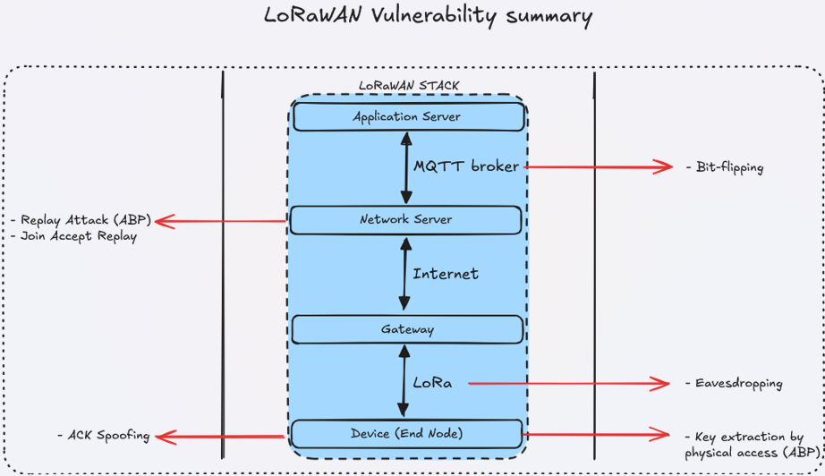

# Internship @ SERMA Safety & Security – LoRaWAN IoT Security Training

## Overview

During my 4-month internship at SERMA Safety & Security (April–August 2025, Rennes), I focused on deploying a complete LoRaWAN IoT chain and evaluating its security through practical RED TEAM attacks. My work combined hands-on vulnerability research, attack demonstrations on real infrastructure, and the creation of educational content for an internal IoT security training toolkit.

---

## Project Structure

### 1. Introduction

This internship aimed to bridge advanced embedded systems, IoT, and cybersecurity by:
- Deploying a realistic end-to-end LoRaWAN environment (sensors, gateways, servers, dashboard).
- Experimenting with and documenting protocol-level and physical attacks on LoRaWAN.
- Delivering technical guides and training modules to raise awareness about real-world vulnerabilities and best practices.

### 2. Infrastructure & Tools

**Hardware**
- **End Devices:** M5Stack Core2 + ASR6501 LoRa module, Wio-E5 Mini, nRF9161DK
- **Gateways:** Raspberry Pi 4 with LoRa concentrator
- **SDR:** HackRF One
- **Other:** UART bridges, ST-Link, environmental sensors

**Software & Frameworks**
- **LoRaWAN Stack:** The Things Network (TTN), ChirpStack (private), Semtech packet forwarder
- **Embedded:** Zephyr OS, nRF Connect SDK, VS Code (+ extensions), west toolchain
- **Application Layer:** Home Assistant (Docker), Mosquitto MQTT broker
- **Security Tools:** WHAD (Wireless Hacking Devices), LoRAttack, Scapy, loracraft
- **Other:** Ubuntu VM, Python, Youtrack (reporting), GitLab (internal), Teams

---

### 3. Attack Scenarios

#### 3.1 Replay Attack (ABP)
- Demonstrated replay attacks exploiting non-volatile frame counters and static keys in ABP mode.
- Successfully injected previously captured packets to disrupt normal device-server communication.

#### 3.2 Eavesdropping
- Used SDR tools (HackRF, WHAD, LoRAttack) to passively capture LoRaWAN frames.
- Showed cryptanalysis potential when frame counters and session keys are reused.

#### 3.3 ACK Spoofing
- Attempted to mislead devices by injecting forged acknowledgments (ACKs) to disrupt confirmed uplink communication.
- Highlighted real-world timing and implementation challenges for this attack.

#### 3.4 Bit-flipping (MQTT Payload Manipulation)
- Performed man-in-the-middle alteration of application-layer data by modifying MQTT payloads between network and application servers (ChirpStack/Home Assistant).
- Demonstrated the impact of lacking end-to-end integrity on IoT data trust.

#### 3.5 Physical Key Extraction
- Extracted LoRaWAN network and application session keys via UART access on end devices.
- Highlighted the persistent risks of physical access and insecure key storage on IoT hardware.

#### 3.6 Join Accept Replay (OTAA)
- Performed join accept replay attacks on OTAA activation, demonstrating the risks if join-accept messages are captured and replayed.
- Used custom packet crafting (Scapy, loracraft) to automate and validate the attack.

---

### 4. Analysis & Results

- Successfully deployed and integrated a complete IoT chain (from sensor to dashboard).
- Demonstrated and documented multiple vulnerabilities for both ABP and OTAA-based LoRaWAN networks.
- Created technical sheets and training modules for each attack, with methodology, results, and recommended mitigations.
- Contributed to the improvement of open-source security tools ([WHAD](https://github.com/whad-team/whad-client), [issue #208](https://github.com/whad-team/whad-client/issues/208)) and internal documentation.
- Highlighted the gap between theoretical security and practical implementation in IoT.

---

## Skills Learned

- **End-to-End IoT Security:** Hands-on deployment and analysis of LoRaWAN from embedded sensors to application dashboards.
- **Embedded Development:** Zephyr OS, nRF Connect SDK, device configuration, troubleshooting.
- **Radio & Protocol Hacking:** Use of SDR (HackRF One), WHAD, and custom scripts for traffic analysis and injection.
- **Network/Cloud Integration:** TTN, ChirpStack, Home Assistant, MQTT workflows in real environments.
- **Offensive Security:** RED TEAM methodology—attack planning, execution, and analysis.
- **Technical Documentation:** Writing training sheets, vulnerability guides, and lab material for future engineers and clients.
- **Collaboration:** Agile tools (Youtrack), code management (GitLab), and teamwork in a professional setting.

---

## References & Annexes

- [LoRaWAN Specification](https://lora-alliance.org/resource-hub/lorawanr-specification-v11)
- [WHAD Documentation](https://whad.readthedocs.io/en/latest/)
- [The Things Network](https://www.thethingsnetwork.org/)
- [ChirpStack](https://www.chirpstack.io/)
- [Home Assistant](https://www.home-assistant.io/)
- [Zephyr Project](https://docs.zephyrproject.org/latest/index.html)
- [LoRAttack](https://github.com/konicst1/lorattack)
- [Wio-E5 Mini](https://www.seeedstudio.com/LoRa-E5-mini-STM32WLE5JC-p-4869.html)
- [nRF Connect SDK](https://academy.nordicsemi.com/)
- [SERMA Safety & Security](https://www.serma.com/)

---
