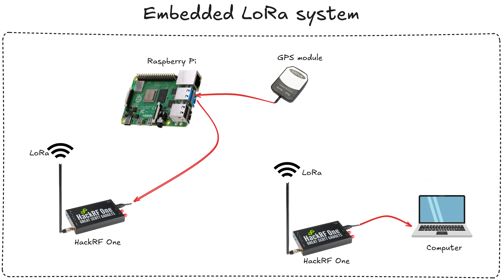

# Embedded GPS/LoRa System

## Overview

This project was my first practical experience in software-defined radio (SDR). The objective was to build an embedded system based on a Raspberry Pi, capable of transmitting GPS coordinates using LoRa technology.

The main hardware components were:
- **HackRF One** for SDR/LoRa transmission
- **Gmouse VK-162** as the GPS receiver
- **Raspberry Pi 4** as the embedded platform

---

---

## Project Structure

### 1. Introduction

Exploration of SDR systems and their applications using GNU Radio Companion, HackRF One, and LoRa. The main goal: create an embedded device able to retrieve and wirelessly transmit GPS data.

### 2. Main Tools

- **GNU Radio Companion**: Visual signal processing environment
- **HackRF One**: SDR device (1 MHz–6 GHz)
- **G-Mouse VK-162 USB GPS Dongle**: NMEA 0183 GPS receiver
- **Raspberry Pi 4**: Low power, flexible embedded computing platform
- **LoRa**: Long-range, low-power radio protocol

### 3. Getting Started

- Documenntation and tool installation (GNU Radio Companion, HackRF One drivers, etc.)
- Creating a basic FM radio receiver flowgraph
- Learning signal visualization and filtering

### 4. LoRa Protocol

- Installing/configuring LoRa-SDR tools
- Testing LoRa transmission and reception flowgraphs
- Error correction (CRC, Hamming encoding)
- Parameter tuning: Spreading Factor, Code Rate, gain settings

### 5. GPS Implementation

- Retrieving GPS coordinates from VK-162 using Python and serial communication
- Integrating GPS data into GNU Radio via a custom Python block
- Installing required Python modules (`pyserial`, `pynmea2`)

### 6. GPS Data Transmission

- Building flowgraphs for sending GPS coordinates via LoRa
- Tuning for message size and transmission reliability
- Using signal visualization blocks (QT GUI Time Sink, Waterfall) for debugging

### 7. Embedded System Setup

- Configuring Raspberry Pi 4 as the transmitter
- OS installation and driver setup
- Power measurements and battery usage
- Range experiments (indoor/outdoor)

### 8. Conclusion

This project covered installation, configuration, flowgraph design, and troubleshooting for SDR and LoRa-based transmission. Key learnings include signal processing, protocol tuning, and embedded integration. Future improvements could include QCSP integration and extending transmission range.

---

## Skills Learned

- **Software Defined Radio (SDR):** Installing, configuring, and using GNU Radio Companion and HackRF One.
- **LoRa Protocol:** Implementing long-range data transmission and reception, flowgraph parameterization, and error management.
- **Embedded Systems:** Setting up, optimizing power, and using the Raspberry Pi 4 for radio applications.
- **GPS Integration:** Acquiring and processing GPS data via a Gmouse VK-162 module and Python scripts.
- **Signal Processing:** Visualizing, filtering, and analyzing radio signals (FM, LoRa, GPS) in GNU Radio.
- **Python Scripting:** Creating custom GNU Radio blocks, managing serial communication, and parsing NMEA data.
- **Troubleshooting & Debugging:** Diagnosing transmission/reception issues, optimizing radio parameters, and resolving software incompatibilities.
- **Technical Documentation:** Writing detailed reports, organizing project structure, and managing annexes.

---

## References & Annexes

- [GNU Radio Wiki - Tutorials](https://wiki.gnuradio.org/index.php/Tutorials)
- [HackRF One - Great Scott Gadgets](https://greatscottgadgets.com/hackrf/)
- [LoRa Protocol Explanation](https://uska.ch/fr/lora/)
- [LoRa_SDR GitHub Repository](https://github.com/tapparelj/gr-lora_sdr)
- [VK-162 GPS Receiver GitHub](https://github.com/AbdullahJirjees/VK-16_GPS)
- [NMEA 0183 Data Format](https://fr.wikipedia.org/wiki/NMEA_0183)
- [Example GPS Ubuntu Integration](https://gpswebshop.com/blogs/tech-support-by-os-linux)

---
